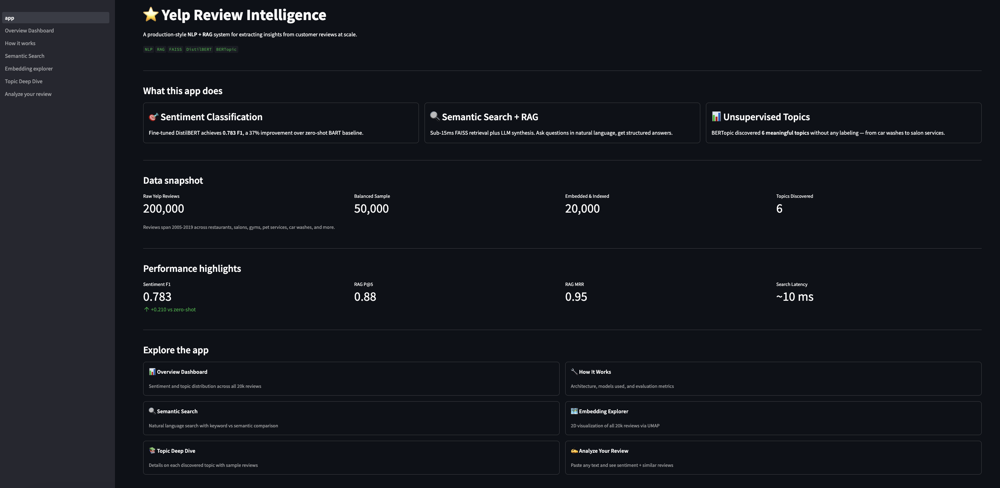
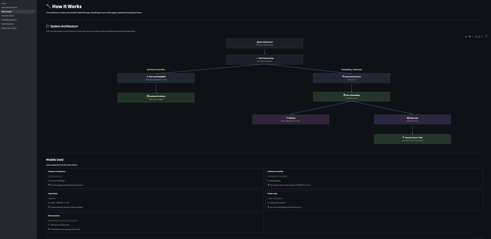
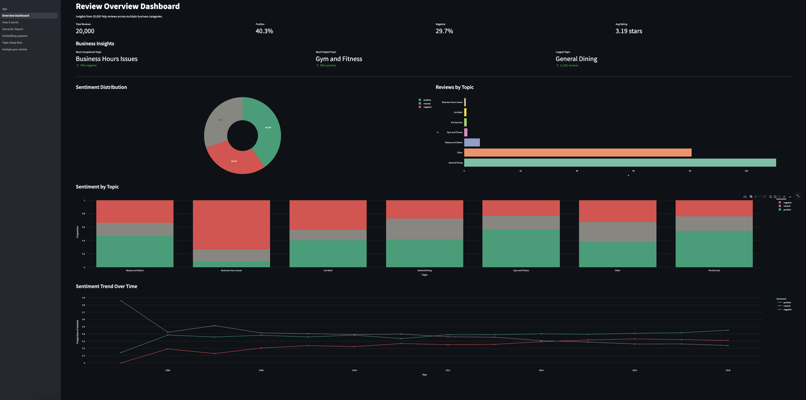
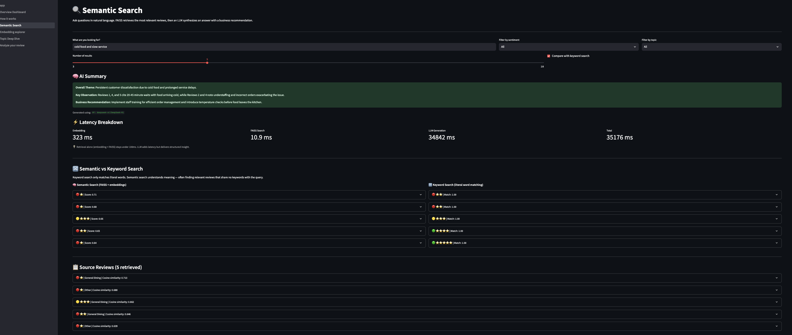
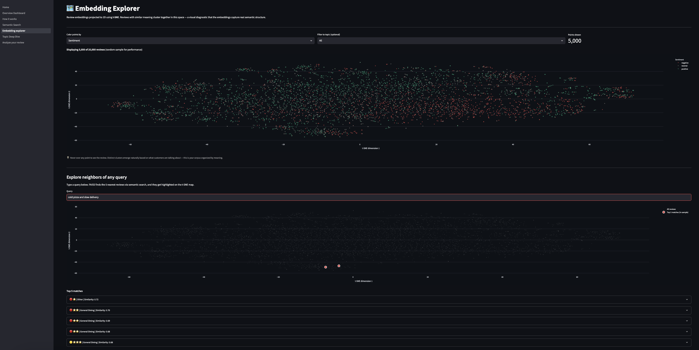
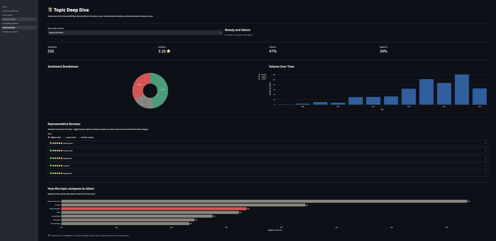
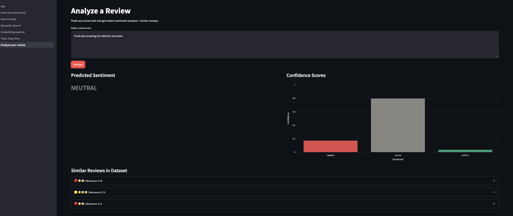

# ⭐ Yelp Review Intelligence

> A production-style **NLP + RAG system** for extracting insights from 20,000 customer reviews at scale.

- 🔗 **Live Demo:** [yelpapp-f2xlaycjkcaapt7cn4wysg.streamlit.app](https://yelpapp-f2xlaycjkcaapt7cn4wysg.streamlit.app/)
- 📦 **Data artifacts:** [HuggingFace Dataset](https://huggingface.co/datasets/aniket32/yelp-review-intelligence-artifacts)
- 📓 **Notebooks:** [`notebooks/`](notebooks/)
- 🎯 **Built as portfolio project for Columbia MS in Data Science (Aug 2026)**
---

## 🚀 Overview

Imagine you're a business owner with 20,000 customer reviews. You can't read them all. This app does three things automatically:

- 🎯 **Classifies sentiment** using fine-tuned DistilBERT — **0.783 F1** (+37% over zero-shot baseline)
- 📚 **Discovers topics** using BERTopic — 6 meaningful topics found unsupervised
- 🔍 **Answers natural language queries** via FAISS semantic search + LLM synthesis (RAG)



---

## 📊 Key Results

| Metric | Score | Context |
|---|---|---|
| **Sentiment F1 (fine-tuned)** | 0.783 | vs 0.573 zero-shot BART baseline |
| **RAG Precision@5** | 0.88 | Industry benchmark: ≥0.7 |
| **RAG Mean Reciprocal Rank** | 0.95 | Industry benchmark: ≥0.8 |
| **Semantic search latency** | ~10 ms | FAISS on 20k vectors |

---

## 🏗️ Architecture

End-to-end pipeline: raw reviews → cleaning → embeddings → FAISS index → three parallel downstream systems.



---

## 📱 App Pages

### 1. Overview Dashboard
Sentiment and topic distribution across all 20k reviews. Business KPIs like "most complained topic" and "most praised topic" surface immediately.



### 2. How It Works
System architecture, models used, and evaluation metrics. Every design decision is documented — no black boxes.

### 3. Semantic Search 🔍
Natural language search over the review corpus with:
- **Semantic vs keyword search side-by-side** — see what FAISS finds that literal matching misses
- **RAG-generated summary** using dynamically discovered HuggingFace models
- **Latency breakdown** (embedding, FAISS search, LLM generation)



### 4. Embedding Explorer 🗺️
All 20k review embeddings projected to 2D using t-SNE. Color by sentiment, topic, or star rating. Type any query and see it lit up in the embedding space with its 5 nearest matches highlighted.



### 5. Topic Deep Dive 📚
Explore each of the 6 discovered topics: top BERTopic keywords, sentiment breakdown, volume over time, and representative reviews (highest rated, lowest rated, or random).



### 6. Analyze Your Review ✍️
Paste any review text and get instant sentiment prediction plus the 3 most similar reviews from the corpus.



---

## 🛠️ Tech Stack

| Layer | Technology |
|---|---|
| **Embedding model** | Sentence Transformers (`all-MiniLM-L6-v2`, 384-d) |
| **Sentiment classifier** | Fine-tuned DistilBERT on 10k Yelp reviews |
| **Topic model** | BERTopic (UMAP + HDBSCAN + c-TF-IDF) |
| **Vector search** | FAISS (`IndexFlatIP`) |
| **RAG generation** | Dynamic HuggingFace model discovery + local `flan-t5-base` fallback |
| **Frontend** | Streamlit multipage app |
| **Visualization** | Plotly, scikit-learn t-SNE |

---

## 🔬 Model Comparison

| Approach | Weighted F1 | Notes |
|---|---|---|
| Zero-shot BART | 0.573 | No training data, out-of-the-box |
| **Fine-tuned DistilBERT** | **0.783** | Trained on 10k Yelp reviews, 3 epochs |

The 0.210 F1 improvement demonstrates the value of domain-specific fine-tuning over general-purpose zero-shot models.

---

## ⚙️ Local Setup

### 1. Clone the repo
```bash
git clone https://github.com/aniket-1704/yelp-review-intelligence.git
cd yelp-review-intelligence
```

### 2. Install dependencies
```bash
pip install -r requirements.txt
```

### 3. Add your HuggingFace token
```bash
mkdir -p .streamlit
echo 'HF_TOKEN = "your_hf_token_here"' > .streamlit/secrets.toml
```

Get a free token at [huggingface.co/settings/tokens](https://huggingface.co/settings/tokens) with **"Make calls to Inference Providers"** enabled.

### 4. Run the app

```bash
streamlit run Home.py
```

On first launch, model artifacts (~350MB) auto-download from the [HuggingFace Dataset](https://huggingface.co/datasets/aniket32/yelp-review-intelligence-artifacts) into `data/`. Subsequent launches use the local cache.

Open http://localhost:8501 in your browser.

---

### Optional: Retrain from scratch

To reproduce the artifacts from the raw Yelp dataset, run the notebooks in order:

```bash
# Download raw Yelp Open Dataset from https://www.yelp.com/dataset

jupyter notebook notebooks/01_EDA.ipynb                      # → app_reviews.csv
jupyter notebook notebooks/02_sentiment_classification.ipynb # → distilbert_sentiment/
jupyter notebook notebooks/03_topic_modeling.ipynb           # → topic labels
jupyter notebook notebooks/04_semantic_search.ipynb          # → faiss_index.bin, embeddings.npy
```

**Note:** Notebooks were originally built on Google Colab with GPU. Fine-tuning DistilBERT (notebook 02) takes ~15 min on a T4 GPU.

### 5. Run the App

```bash
streamlit run Home.py
```

Open http://localhost:8501 in your browser.

---

## 📓 Notebooks

The complete training and evaluation pipeline, structured day-by-day:

| Notebook | Purpose |
|---|---|
| `01_EDA.ipynb` | Data cleaning, exploration, class balancing |
| `02_sentiment_classification.ipynb` | Zero-shot BART vs fine-tuned DistilBERT |
| `03_topic_modeling.ipynb` | BERTopic topic discovery |
| `04_semantic_search.ipynb` | Sentence embeddings + FAISS indexing |
| `05_rag_evaluation.ipynb` | Precision@K, MRR, latency evaluation |

---

## 🎯 Project Design Choices

**Why fine-tune DistilBERT vs use zero-shot?**
Zero-shot BART achieved 0.573 F1. Fine-tuning on 10k domain-specific reviews pushed it to 0.783 (+37%). This quantifies exactly when supervised fine-tuning is worth the compute.

**Why BERTopic over LDA?**
BERTopic uses semantic embeddings (BERT-based) instead of bag-of-words. Reviews saying "the food was cold" and "my meal arrived lukewarm" cluster together despite sharing no keywords — impossible with LDA.

**Why FAISS over vector databases like Pinecone?**
For 20k vectors on a single-user demo, FAISS `IndexFlatIP` gives exact cosine similarity in ~10ms with zero infrastructure overhead.

**Why dynamic HF model discovery?**
HuggingFace's inference providers change frequently. Hardcoded model IDs deprecate. The app queries the HF Hub API for currently-available trending models, ensuring the RAG pipeline stays functional even as HF's routing evolves.

---

## ⚠️ Known Limitations

- **Abstract queries perform worse** — "friendly atmosphere" scores lower than "long wait times". Embedding models handle concrete details better than experiential concepts. Fix: LLM-based query expansion.
- **6 topics is thin for 20k reviews** — BERTopic clustered aggressively. Larger corpus (50k+) or tighter HDBSCAN params would surface finer topics.
- **Neutral class remains hard** — 3-star reviews are genuinely ambiguous. Binary positive/negative framing may serve business use cases better.

---

## 🚢 Deployment Architecture

- **Frontend:** Streamlit Cloud (auto-deploys on `git push` to `main`)
- **Model + data artifacts:** Hosted on HuggingFace Dataset Hub, downloaded on first launch via `hf_hub_download`
- **RAG inference:** Dynamic HuggingFace Inference API model discovery with local `flan-t5-base` fallback
- **Python:** 3.11 (pinned via `runtime.txt` for reproducibility)

This split keeps the GitHub repo lean (~5MB) while artifacts (~350MB) live where they belong.

---
## 👤 Author

**Aniket Gupta**
Systems Software Engineer at HPE · Incoming MS DS at Columbia University (Aug 2026)

- [LinkedIn](https://linkedin.com/in/aniket-gupta-8427a2217)
- [GitHub](https://github.com/aniket-1704)

Background in production ML systems (AutoTriageX with Mistral 7B, XGBoost bug prediction, ACO test optimization). This project extends that experience with modern NLP and RAG for the public portfolio.

---